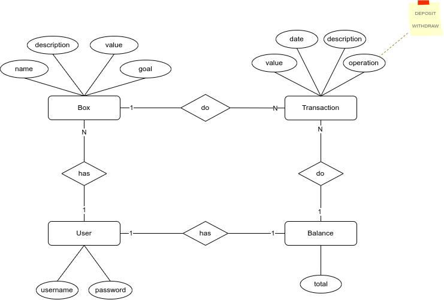
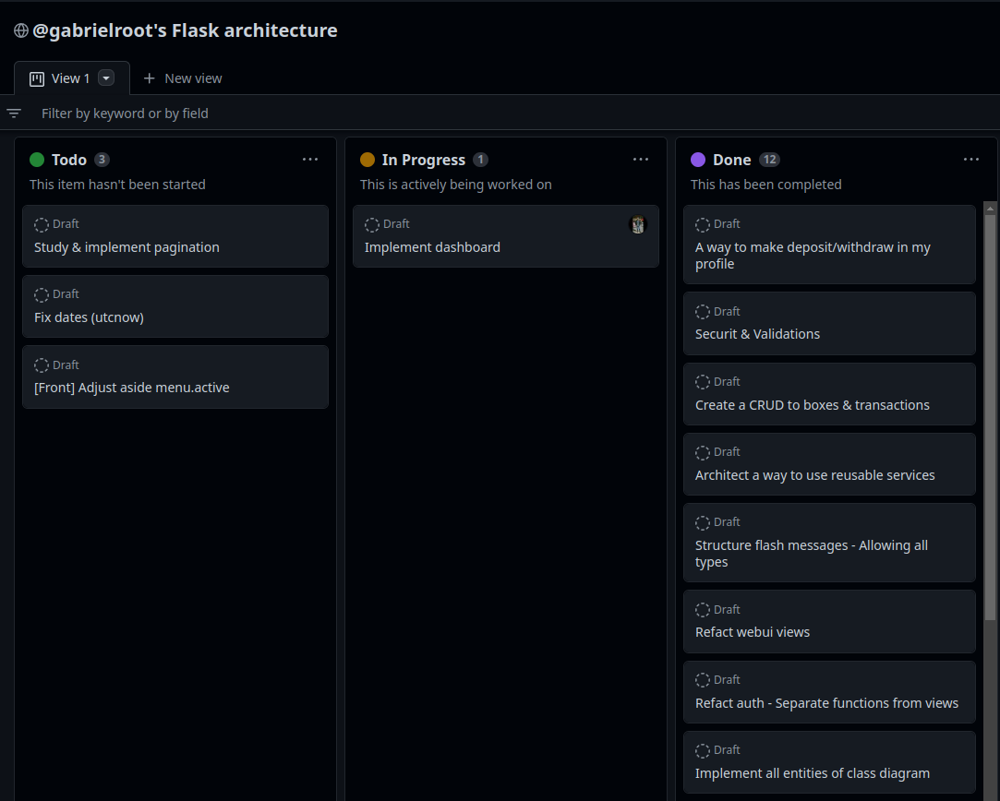
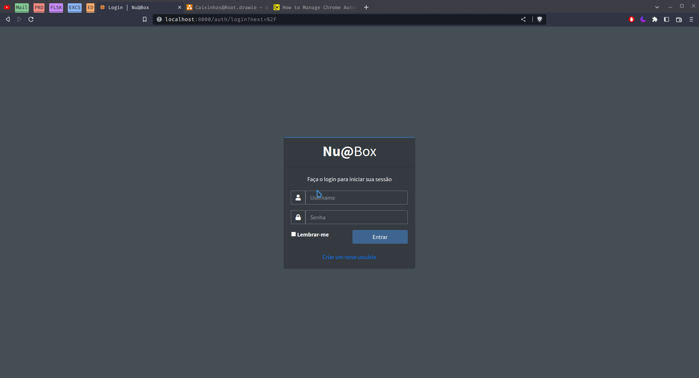
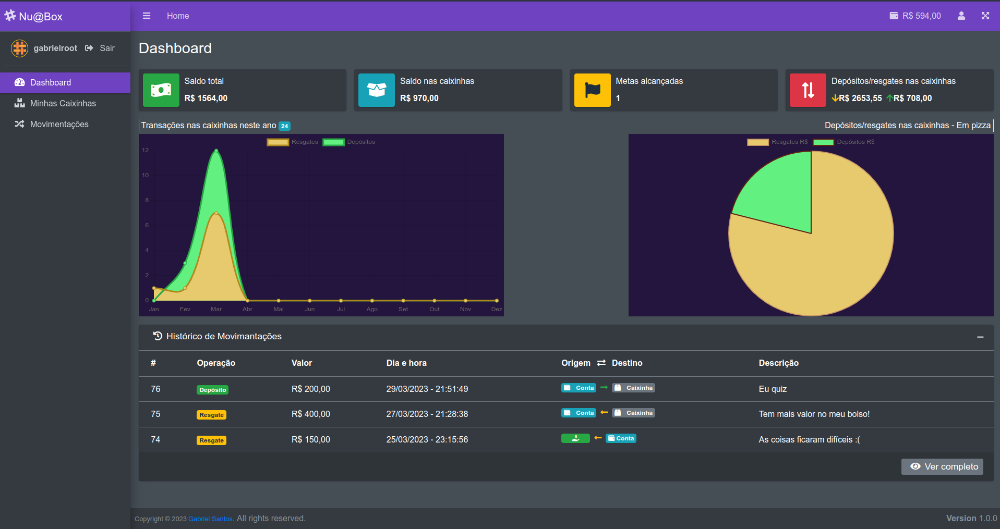
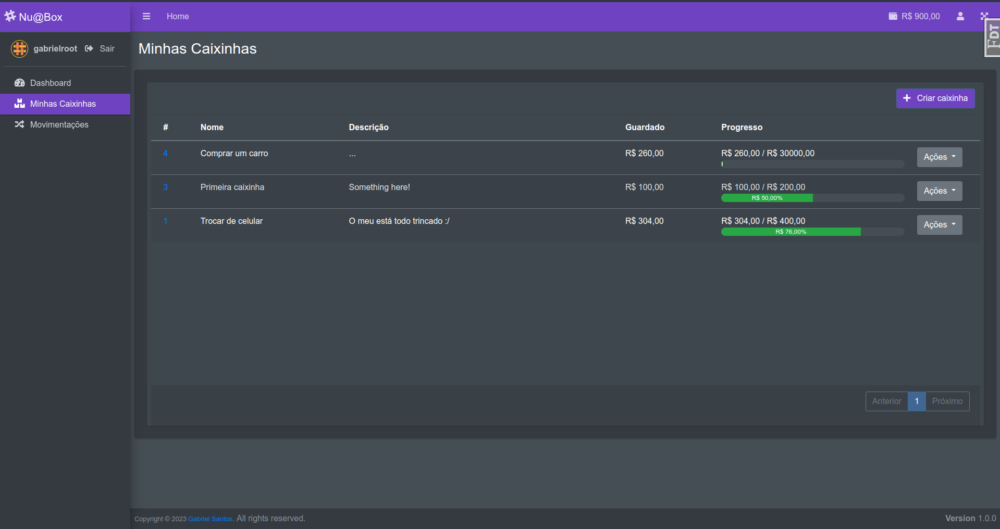
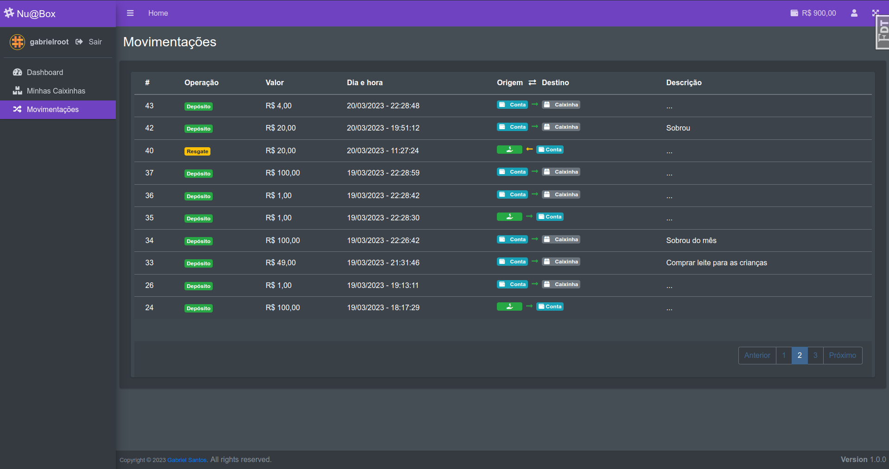
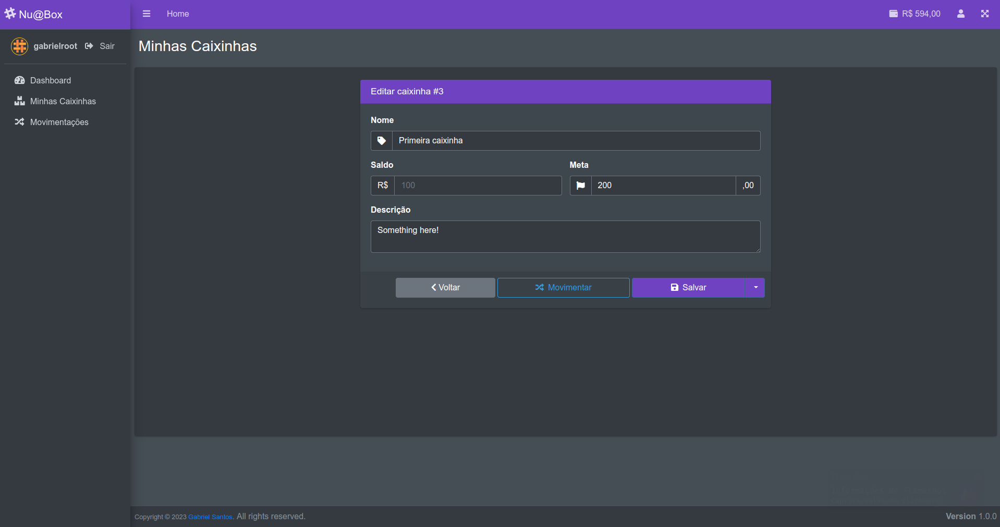

# Nu@Box

> Um remake das caixinhas do Nubank

No ano passado (2022) a [@nubank](https://www.github.com/nubank) , um banco digital em ascensão no mercado, criou uma nova funcionalidade que viria permitir que seus usuários pudessem além de guardar valores, definir objetivos para eles.
 
 
Essa criação me cativou muito devido a eu ter sentido falta dessa característica anteriormente e ter sido um dos que sugeriram tal feito.
 
 
Quando me foi solicitado como trabalho avaliativo da disciplina "Arquitetura de Software", o desenvolvimento de qualquer projeto em mente, que implementasse uma arquitetura predeterminada, isso me veio logo à mente:
> Criar um remake de funcionalidade.

 
A arquitetura base utilizada foi a do @rochacbruno, do canal codeshow. Tem como característica o uso dos padrões 'Factory Method + Singleton' na instanciação do app Flask. Com o adicional do uso de extensões, como forma diminuir o acoplamento do projeto. 

 

## Passos para inicializar a aplicação
- Copie o arquivo `.env.sample` e o renomeie para `.env`
- Copie o arquivo `settings.toml.sample` e o renomeie para `settings.toml`
- Esteja na pasta do projeto e execute os seguintes comandos no terminal:
- `docker-compose up -d --build`
> Aguarde até o serviço `db` estar "ready to accept connections"
- `$ docker exec -it main flask db upgrade`

## OK! A aplicação já estará em execução

Agora basta acessar a aplicação através do navegador pelo endereço http://127.0.0.1:8000
 
E caso necessite, o Adminer em http://127.0.0.1:8080

## Manipulando novas Migrations

- `docker exec -it main flask db migrate -m "New migration."` - Para gerar uma nova migração, com base na diferença entre a estrutura do código (Models) e a do banco.

- `docker exec -it main flask db upgrade` - Para executar (efetivar) as alterações, no banco de dados.

- `docker exec -it main flask db` - Para ver todos os comandos disponíveis do Flask-Migrate.

- `docker exec -it main flask` - Para ver todos os comandos disponíveis do Flask.

 
 

# Documentação

 
 

# Processo

 
 

# Capturas

### - Apresentação
> 

### - Dashboard
> 

 

### - Minhas Caixinhas
> 

 

### - Minhas Movimentações
> 

 

### - Editar Caixinha
> 
